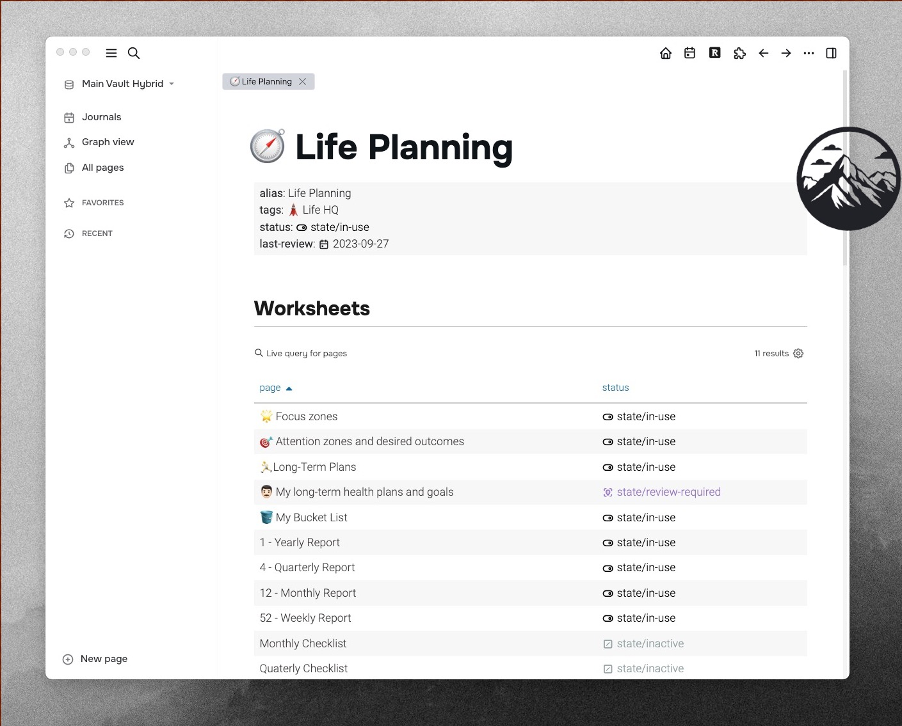

# Logseq Slavsko Theme ⛰️

Minimal light [Logseq](https://logseq.com/) theme with bold typography and cyrillic font support. It's named after a skiing resort in Ukraine because the titles are bold like mountains. 


## Features

### Better looking tables


### Bullet drill-down enhancement
When drilled down, the parent bullet has its bullet hidden, font size incerased, guideline removed, and various alignment tweaks to get it inline with the breadcrumb + child blocks.

Courtesy of [@Zyrohex](https://discuss.logseq.com/t/style-changes-when-drilling-down-a-block-level/22051) from Logseq forums.

### Hidden query builder


I've hidden the simple query builder so that with queries pages look cleaner. If you'd like it to stay, find and delete this piece:

```css
.cp__query-builder {
    display: none;
  }
```

## Installation

The theme **is not** yet available on the Logseq marketplace. It's just a CSS file you copy to your Logseq Vault folder inside 'logseq' directory. The path should be like `/path-to-your-logseq/vault-name/logseq/custom.css`. 

Alternatively you can search for a `custom.css` file from within your logseq like any other page and copy-paste the code from my [custom.css](custom.css) file.

## Plugin compatibility

### Awesome Links Plugin
- [logseq-awesome-links](https://github.com/yoyurec/logseq-awesome-links)
- 🟨 There's an issue with custom page icon positioning.

### Bullet Threading Plugin
- [logseq-plugin-bullet-threading](https://github.com/pengx17/logseq-plugin-bullet-threading)
- 🟩 Looks great!


## Licence

Licensed under the MIT License.

## Credits

- A big chunk of the code I got from the [miA theme](https://github.com/playerofgames/logseq-mia-theme). 
Huge kudos to the theme creators 💛
- I am using the [Onest font](https://fonts.google.com/specimen/Onest), which looks gorgeously with ukrainian cyrillic, and Roboto for tables.

## Bugs and feedback
If you find a bug, file it under "Issues" with a short description and a screenshot.
If you'd like to improve on the theme, please use a merge request.

## Slavsko mountains in summer


*Photo by [@Gelo Korpstevy](https://www.instagram.com/gelo_korpstevy/)*

